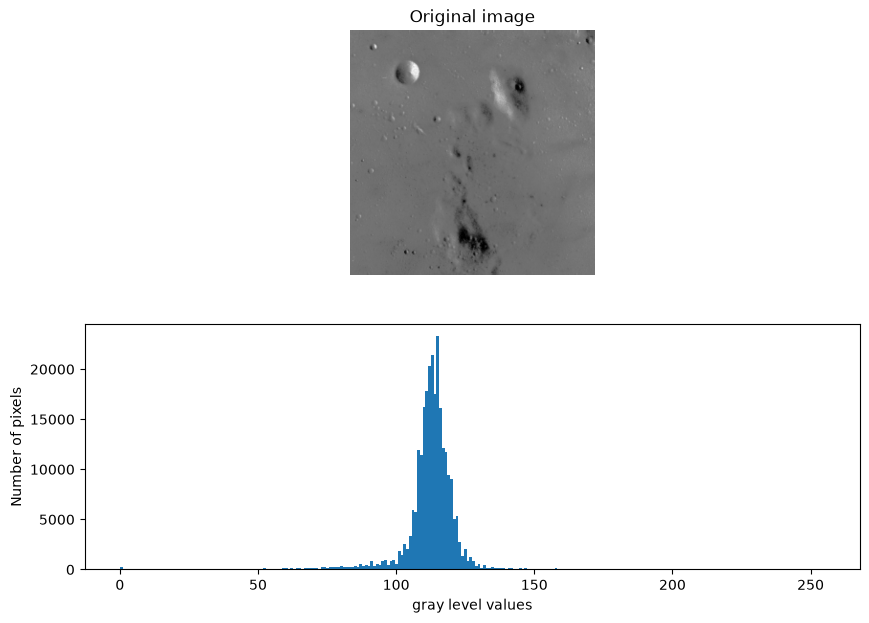
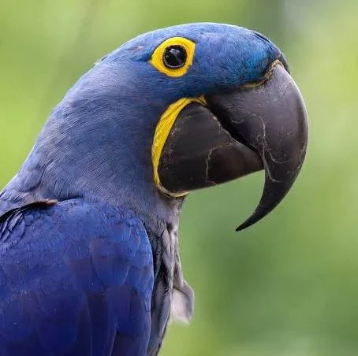
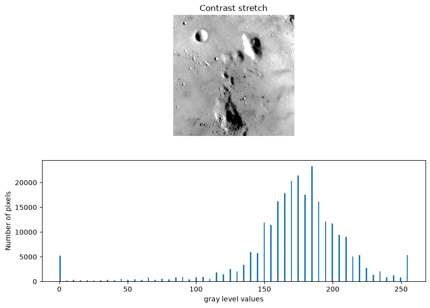

# Lab 4 — Images

هذا الملف يجمع جميع الصور الموجودة في مجلد Lab4 بترتيب واضح.

## 1. Original Image

## 2. Parrot

## 3. Contrast Stretch

## 4. Contrast Stretch — 3rd to 80th Percentile

.png)

## 5. Histogram Equalization

## 6. Source, Reference, and Matched

%2C%20Reference%20(Rocket)%2C%20Matched.png)

## 7. Source, Reference, and Matched — Alternative

